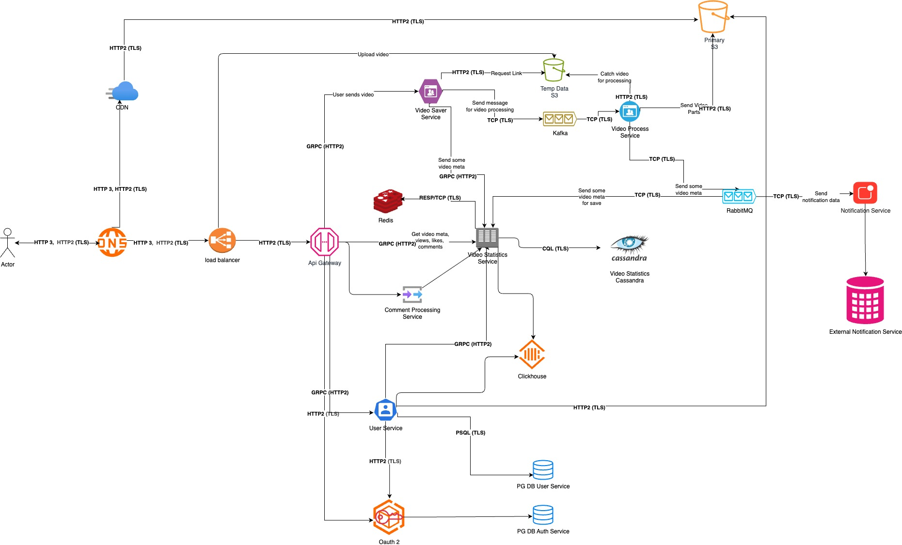

# 1. Система потокового видео

Дмитрий, работаю в X5 Tech python разработчиком, подготовил проект системы потокового видео

## 2. Требования (Что нам вообще надо?)

### 3. Функциональные требования
1. Регистрация, авторизация, изменение профиля.
2. Загрузка и удаление видео для автора.
3. Список видео по фильтрам, просмотр для потребителя.
4. Лайк/дизлайк/комментарии на видео.
5. Просмотр статистики видео.

### 4. Нефункциональные требования
1. DAU - 2-3 млн, MAU - 10 млн.
2. Долгое ранение видео (следующие слайды).
3. 95% HTTP запросов должны быть обработаны за <= 1 секунду.
4. Поддержка 1000 одновременных загрузок видео.
5. Задержка перед воспроизведением видео < 5 секунд (независимо от длительности видео).
6. Доступность системы >= 99,99 %/мес.

Исходя из требований строим AP систему (High availability, partition tolerance)

## 5. Обзор

* Система почти полностью располагается на одном ЦОД в кубере, кроме CDN, S3.
* Дефолтные load-balancer, api-getaway, несколько сервисов CRUD, сервис нотификаций слушающий кролик (для отложенных сообщений).
* Интересное:
    * Группа сервисов для обработки видео через очередь.
    * CassandraDB легко масштабируется, отказоустойчивая без расширений (идеально подходит для AP).
    * Kafka - нужна отказоусточивость и масштабируемость в группе сервисов по обработке видео.
    * Хранение видео:
        * Разные виды качества кусочков видео (в том числе 2к и больше) + оригинальный файл - 3 месяца.
        * После 3го месяца начинаем убирать непопулярные форматы, оставляем только (480, 1080, 2к) и убираем оригинальный файл.
        * через год оставляем только 1080
    * Масштабирование везде горизонтальное, но в сервисе обработки видео еще и вертикальное. (смотрим на нагрузку CPU, GPU).

## 5. Спасибо за внимание
