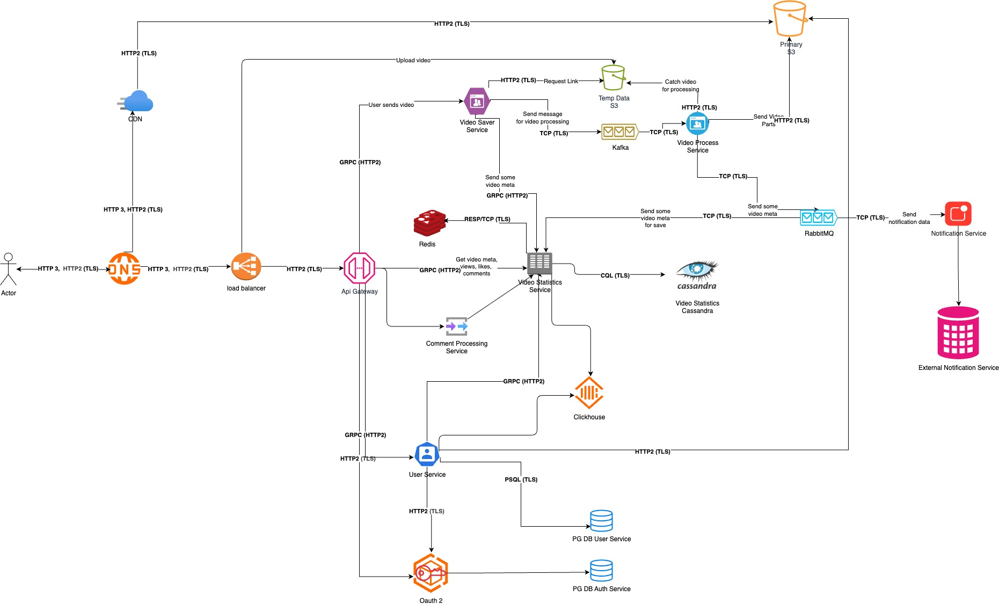
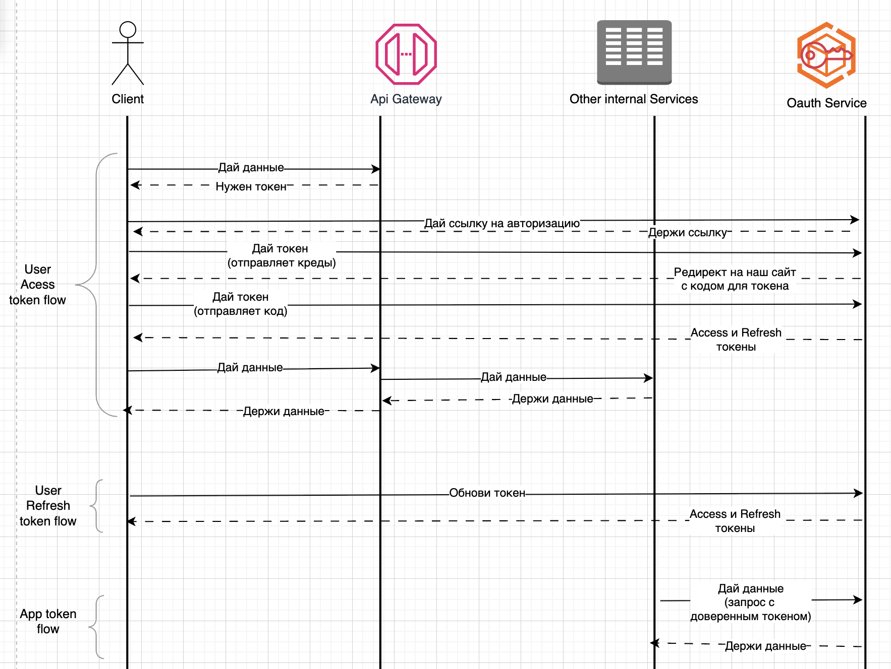

# Проектирование системы "Видео-стриминга"

## 1. Требования к системе:

### 1.1. Функциональные требования
1. Регистрация, авторизация.
2. Изменение профиля.
2. Загрузка, просмотр и удаление видео.
3. Список видео по фильтрам.
4. Лайк/дизлайк на видео.
5. Комментирование видео.
6. Просмотр статистики видео.

### 1.2. Нефункциональные требования
1. 95% HTTP запросов должны быть обработаны за <= 1 секунду.
2. Поддержка 1000 одновременных загрузок видео.
3. Задержка перед воспроизведением видео < 5 секунд (независимо от длительности видео).
4. Доступность системы >= 99,99 %/мес.
5. Все данные передаются по SSL/TLS.
6. Персональные данные в БД зашифрованы.
7. Автоматическое горизонтальное масштабирование (авто скейлинг).
8. Адаптивный интерфейс (mobile first).
9. Покрытие авто тестами >= 80%.

### 1.3. Целевые метрики
1. Время исполнения запросов (95% HTTP запросов должны быть обработаны за <= 1 секунду).
2. Количество одновременных загрузок (от автора на сервер) видео (Поддержка 1000 одновременных загрузок видео).
3. Скорость загрузки видео зрителем (Задержка перед воспроизведением видео < 5 секунд).
4. Доступность системы (>= 99,99 %/мес).

Т.е. по CAP теореме выбираем как приоритет Availability и Partition tolerance.

## 2. Архитектурное проектирование

### 2.1. Схема:

### 2.2. Ключевые компоненты:
1. Балансировщики нагрузки / Nginx.
2. API Gateway.
3. Набор сервисов для обработки видео.
    1. Сервис для получения первичных данных о видео.
    2. Временное хранилище для сырого видео.
    3. Очередь.
    4. Сервис обработки видео.
4. Сервис данных / статистики о видео.
5. Сервис валидации комментариев.
6. Сервис авторизации
7. Сервис пользовательских данных (для снятия нагрузки с сервиса авторизации).
8. Сервис нотификаций.

### 2.3. Общение
* Пользователь -> API Gateway: HTTP3 тк связь не стабильна
* Межсервисное взаимодействие:
    * С Notification Service через RabbitMQ для отложенных сообщений и постепенной обработки.
    * C Video Processing Service через Kafka для гарантии доставки и постепенной обработки.
    * Остальные сервисы общаются по grpc (HTTP2).
    * Инфраструктурные сервисы - по своим протоколам.

### 2.4. Масштабируемость и высокая доступность

1. Масштабирование - в системе по обработке, просмотру видео и сбору их статистики я применил оба алгоритма:
    1. У нас очень много IO-bound операций поддающихся параллелизму, поэтому создаем несколько контейнеров одного 
    приложения, а также выбрать горизонтальное масштабирование основным.
    2. Вместе с этим, у нас есть сервис обработки видео, который хорошо вертикально масштабируется, так как 
    там очень много зависит от мощности и количества ядер CPU, GPU и от объема RAM.
    3. Также при выборе между горизонтальным и вертикальным масштабированием, ориентируемся на данные по нагрузке,
    CPU и остальных компонентов: если помогают новые инстансы - добавляем их, иначе увеличиваем мощности.
2. Геораспределенность + CDN - помогает снизить нагрузку на основные сервера; сделать сервера ближе к пользователю, что ускоряет обработку его запросов.
3. Высокая доступность - при отказе одного из инстансов приложений и/или нод CDN, и/или БД пользовательские запросы переводятся на любой другой, если нагрузка слишком большая - добавляем новые инстансы.
4. Также для высокой доступности стоит настроить метрики и алерты в графане, чтобы моментально реагировать на аварии.

## 3. Выбор технологий

### Основная БД - CassandraDB
Основная причина выбора - легко обеспечить AP (из CAP теоремы).
* Легко добавляется новая нода.
* При отключении любой из нод система продолжает функционировать без задержек.
* Данные имеют копии на нодах в количестве replication_factor (обычно 3, реже 5), но общее число нод можно настроить сильно больше.

### БД для авторизации - PostgreSQL
* Необходимость транзакций и отношений.
* Множество плагинов в том числе для безопасности.
* С JWT токенами подразумевается не большая нагрузка на этот сервис -> меньше надобности в масштабировании, хотя read реплики все равно придется использовать.

### Очередь на обработку видео - Apache Kafka
* Очень высокая пропускная способность.
* Долговременный лог событий.
* Идемпотентные продюсеры, транзакции, откаты, повторный прогон.

### Очередь для нотификаций - RabbitMQ
* Гибкие шаблоны маршрутизации (direct/topic/fanout).
* Легко настроить отложенные уведомления.
* Низкая задержка.
* Удобные ack/перепоставки.

## 4. Реализация нефункциональных требований

### 4.1. Безопасность
* Использование TLS
    * HSTS - Принудительный переход с HTTP на HTTPS.
    * Используем только TLS 1.3 (PFS встроен).
    * Выбираем сильные шифры: AES-256-GCM, ChaCha20-Poly1305.
    * Используем TLS Session Tickets для ускорения реконекта.
* Шифрование данных
    * Хешируем пароли через алгоритм Argon2id
    * Шифруем персональные данные (email, номер телефона и другие) через алгоритм AES-256-GCM. В PG есть возможность делать это нативно, можно вшить в шаблон проектирования репозиторий.
    * Шифруем JWT токены через ассиметричный ECDH-ES.
* Список прав определяется только разработчиками, так как в коде будут захардкожены ключи для них, и при попытке получения доступа к ресурсу будет проверяться наличие этого ключа в jwt токене.
* Нельзя выдавать пользователям отдельные права, либо добавить ее в роль, либо создавать кастомную роль.

### 4.2. Схема получения авторизационного токена

### 4.3. Методы мониторинга и управления системой

Используем:
* ELK для логов.
* Grafana + prometheus для метрик + алертинга.
* Sentry для алертинга.

* Метрики
    * Количество запросов к ресурсам, на которые у пользователя нет прав.
    * Количество пользователей с слишком большим RPS.
    * RPS с одного IP по авторизации.
* Алерты:
    * При большом количестве долгих запросов.
    * При большом количестве 5xx.
    * При падении сервиса.
    * Алерты при появлении не консистентных данных в конкретных местах, который мы пытались предсказать.

## 5. Риски и компромиссы

* Как писал выше, в системе делается приоритет на AP, так как пользователям не получать самую свежую информацию. Например, лайк может появиться на одной из нод CassandraDB раньше, чем на другой.

* CassandraDB легко масштабируется, но не при пиках нагрузки. Мы можем не угадать с количеством нод и наша система будет вынуждена либо терпеть большие нагрузки с задержками запросов, либо еще больше увеличить нагрузку, добавив новую ноду, которая начнет ребалансировать данные. Поэтому тщательно следим за нагрузкой на бд и добавляем ноды при надобности.
