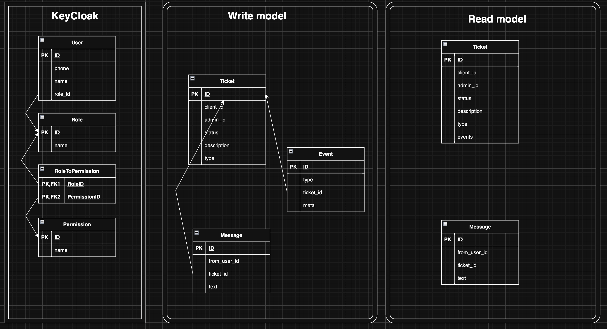
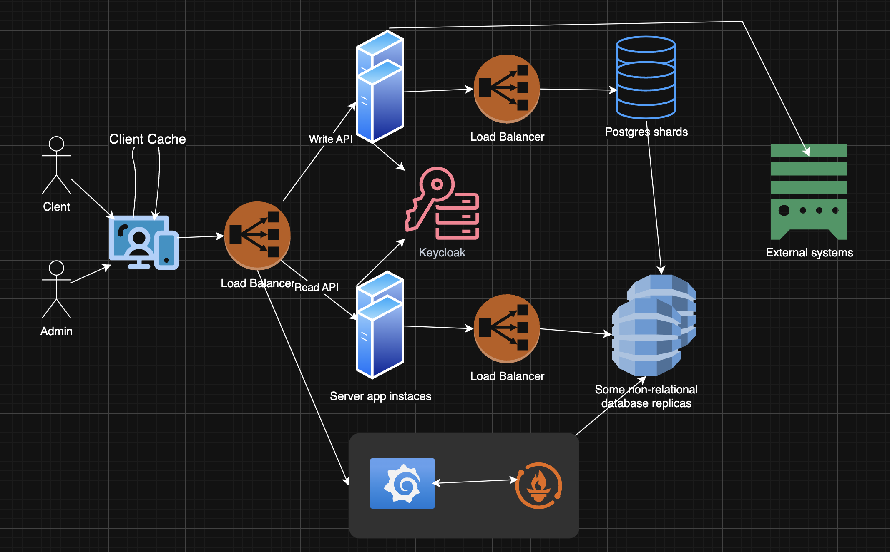

# Проектирование масштабируемой и устойчивой системы для обработки пользовательских заявок (СОПЗ)

## 1. Требования к системе:
- Функциональные требования:
  1. В системе должна быть ролевая система, для разделения пользователей на клиентов, администраторов, менеджеров.
  2. Клиент может создать, просмотреть и отменить свои заявки.
  3. Администратор может просмотреть, изменить статуса заявок.
  4. Система автоматически назначает ответственного за обработку заявки по их загрузке, 
  а так же должно быть ручное переназначение менеджером.
  5. Клиент и администратор могут общаться в чате по поводу заявки клиента.
  6. Система должна отправлять сигналы в другие системы для уведомления о решении заявки.
- Нефункциональные требования:
  1. 90% HTTP запросов должны быть обработаны за <= 1 секунду.
  2. Поддержка 1000 одновременных соединений.
  3. Доступность системы >= 99,9 %/мес.
  4. Все данные передаются по SSL/TLS.
  5. Автоматическое горизонтальное масштабирование (авто скейлинг).
  6. Адаптивный интерфейс (mobile first).
  7. Покрытие авто тестами >= 80%.

## 2. Выбор архитектурного стиля:

В СОПЗ у нас очень мало доменов и небольшая функциональность, а также только 2 пользователя взаимодействуют с одними данными
(Что уменьшает влияние блокировок).
Поэтому в этой системе скорее всего можно пожертвовать масштабируемость ради скорости и легкости разработки.

- Микросервисы:
    От микросервисов я отказался сразу, так как почти все операции в системе будут выполняться с одними и теми же сущностями.
- SOA:
    Можно рассмотреть в будущем, если появится большое количество интеграций, или если появится необходимость в фоновых задачах.
- Модульный монолит:
    Для меня кажется наилучшим выбором для СОПЗ. По необходимости можно добавлять небольшие сервисы, например, 
    с самого старта я хочу вынести авторизацию в Keycloak, так как эта система не может существовать самостоятельно, 
    а будет работать вместе с другими системами, где скорее всего уже будет своя единая система авторизации. 
    По необходимости модули можно выносить в отдельные сервисы, например, сложные интеграции.

## 3. Метрики SLA, SLO и SLI
- SLA:
  1. Гарантированное максимальное время запроса - 2 сек 
  2. Гарантированная доступность - 99.5%
- SLO:
  1. Среднее время обработки запроса <= 1 секунды.
  2. Доступность системы >= 99,9 %/мес.
- SLI:
  1. Метрика request_time в Grafana (не должно быть взлетов на графике выше 2 секунд)
  2. Метрика success_rate Grafana (не должно быть падений на графике ниже 99.5%)

## Применение шаблонов проектирования

- CQRS
  1. Read-модель масштабируется отдельно от write-модели, что позволяет обрабатывать сотни запросов к 
    выгрузкам/графикам/статистикам без влияния на запись новых тикетов.
  2. Можно хранить данные в write БД только за короткий период времени (день-неделя).
  3. Лаг при загрузке данных в Read API не так важен для СОПЗ.
  4. Сбой или задержка в write-слое не блокирует чтение, обеспечивая доступность UI.
  5. Read-модель обновляется асинхронно по событиям из Event Store, поэтому данные в Read-модели 
    могут отставать на секунды. Это приемлемо для СОПЗ.
        
- Saga

Учитывая, что я выбрал монолитную архитектуру, Saga не можно будет применить только, для общения с внешними системами.

Оркестрация поможет сохранить правильное состояние тикета, например, в случае возврата средств, 
которое должно происходить на стороне внешней системы, и отменяться, если что-то в последующих шагах пошло не так.

Это поможет консистентности данных между системами.

## Кэширование
Использование кэша о сообщениях/чатах в активных заявках на стороне веб/мобильного приложения - позволяет не получать
  из Read слоя, где новые сообщения могут не подгружаться в случае перезагрузки страницы + сокращает количество запросов.

Кроме этого тяжело найти применение кэшу в нашей системе т.к.
1. Для тикетов и сообщений будет достаточно Write операций.
2. Для статистик и графиков этой оптимизацией будет заниматься Grafana/Prometheus.

## Архитектура

### БД

### Система

