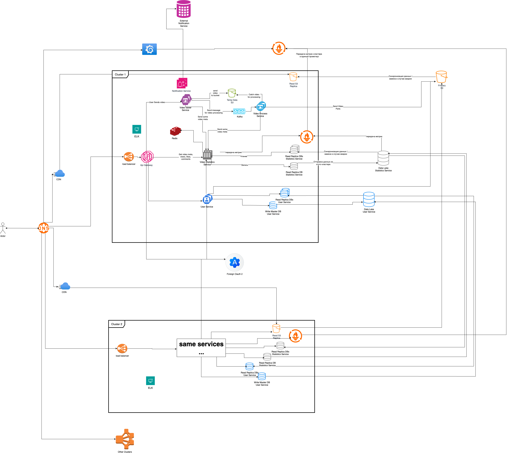

# Проектирование около Ютуба

## Архитектура
### Система

## 0. О системе
Решил спроектировать недоЮтуб с ограниченным функционалом, только самым важным:
1. Авторизация
2. Просмотр видео
3. Лайк на видео
4. Комментирование видео
5. Добавление видео
6. Просмотр статистики видео
7. Список видео по фильтрам
8. ~~Рекомендательная система~~

## 1. Содержание системы:
1. Будет несколько кластеров каждый из которых может работать самостоятельно.
2. Load balancer будет распределять по запрос по getaway-ам по принципу Round Robin.
3. Getaway перенаправляет запросы в нужный сервис также по принципу Round Robin.
4. Foreign Oauth 2 service отвечает за аутентификацию, авторизацию, идентификацию пользователей.
5. User service занимается все, что касается пользователя (кроме функций сервиса выше), данные, статистика, управление профилем.
6. Группа сервисов связанных с видео, выполняет сложную логику для обработки видео и улучшения пользовательского опыта.
   1. Сначала Video Saver Service сохраняет видео во временное хранилище и отправляет событие в кафку.
   2. Video Saver Service отправляет мета данные о видео в Video Statistics Service.
   3. Video Process Service слушает кафку и ждет событие с ключом видео, которое нужно обработать.
   4. Video Process Service обрабатывает видео (делит на куски, перекодирует, сжимает, накладывает фильтры и т. д.)
   5. Video Process Service сохраняет обработанные файлы в Primary хранилище.
   6. Video Process Service отправляет мета данные о видео в Video Statistics Service.
7. Video Statistics Service собирает все данные по видео - просмотры, лайки, комментарии и т.д., собирает агрегаты
и сохраняет их в редис с обновляющимся ttl при запросе.
8. К Notification могут обращаться все сервисы (не хотел лишние связи рисовать). После чего перенаправляет во
внешнюю систему нотификаций.
9. Запросы от пользователя до getaway идут по Rest API. Почти все межсервисное взаимодействие происходит по протоколу gRPC.
Делегирование больших, сложных задач/запросов происходит через кафку.

Группа сервисов для обработки видео создана чтобы:
1. Пользователь (автор) не ждал ответа от сервиса обработки видео.
2. При возникновении ошибки при обработке (после загрузки), можно было запустить повторную обработку 
(и пользователю (автору) не нужно перезагружать видео).
3. Раздробить видео на куски, чтобы пользователь (потребитель контента) не ждал загрузки всего видео как в самом начале,
так и при перемотке в любую часть видео.

## 2. Требования к системе:
### 2.1. Функциональные требования
1. Авторизация
2. Регистрация
3. Загрузка видео
4. Просмотр видео
5. Лайк на видео
6. Комментирование видео
7. Просмотр статистики видео
8. Список видео по фильтрам
### 2.2. Нефункциональные требования
1. 90% HTTP запросов должны быть обработаны за <= 1 секунду.
2. Поддержка 1000 одновременных загрузок видео.
3. Задержка перед воспроизведением видео < 5 секунд (независимо от длительности видео).
4. Доступность системы >= 99,99 %/мес.
5. Все данные передаются по SSL/TLS.
6. Автоматическое горизонтальное масштабирование (авто скейлинг).
7. Адаптивный интерфейс (mobile first).
8. Покрытие авто тестами >= 80%.
9. Кластеры расположены в разных ЦОД.

## 3. Выбор между вертикальным и горизонтальным масштабированием:
В системе по обработке, просмотру видео и сбору их статистики я бы применял оба алгоритма:
1. У нас очень много IO операций поддающихся параллелизму, поэтому можно сразу создавать несколько контейнеров одного 
контейнера, а также выбрать горизонтальное масштабирование основным.
2. Вместе с этим, у нас есть сервис обработки видео, который 100% будет хорошо вертикально масштабироваться, так как 
там очень много зависит от мощности и количества ядер CPU, GPU и от объема RAM.
3. Также при выборе между горизонтальным и вертикальным масштабированием, мы можем ориентироваться на данные по нагрузке,
CPU и остальных компонентов: если помогают новые инстансы - добавляем их, иначе увеличиваем мощности.

## 4. CAP-теорема
Для этой системы я выбрал Availability и Partition tolerance, поскольку:
1. Availability (требуется по заданию)
2. Partition tolerance - Пользователю всегда хочется смотреть видео, и мы можем легко масштабировать систему при большой нагрузке.
3. ~~Consistency~~ - нам не очень важны каждый лайк, каждый комментарий, остальная статистика и загруска новых видео мгновенно.

## 5. Синхронизация БД
При нормальной работе:
* Сервисы в рамках кластера отправляют данные в master БД, которая хранит только данные с текущего кластера.
* Все master DB отправляют новые данные в общий data lake, который синхронизирует данные с read репликами в разных кластерах.
* Сервисы читают данные с read реплик.

Вынес сервис авторизации во внешнюю систему, тк данные с этого сервиса может быть важно синхронизировать всегда.
В остальных сервисах при отказах или при слишком медленной синхронизации, для нас это почти не важно.

## 6. Сценарии отказов
1. Отключение master БД, S3: выбираем новый master БД из read реплик.
2. Отключение одной из read реплик: увеличение нагрузки на остальные read реплики, разбираемся, что случилось, поднимаем.
3. Отключение data lake: master с всех кластеров ждут отправки новых данных, пока мы экстренно не починим data lake
4. Много timeout-ов: Добавляем инстансы / кластеры
5. 500 ответ
   1. настраиваем алерты, чиним
   2. в случае больших задач, как обработка видео, не коммитим сообщение из кафки
   3. или коммитим, но перебрасываем его в очередь с ошибками

## 7. Рекомендации по обеспечению непрерывной работы системы
1. Мониторинг системы: Prometheus, Grafana
2. Предупреждения об ошибках, слишком больших/маленьких показателей
3. Хранение логов
4. При увеличении нагрузки увеличивать количество инстансов / кластеров
5. Если не помогает масштабируем вертикально
6. Размещаем кластеры в разных регионах
7. Минимум 2 реплики каждого сервиса.
8. Чёткое разделение зон ответственности между командами Dev, Ops, SRE.

## 8. Оптимизация производительность

### 1. Индексы 
1. User Service DB: индексы по user_id, email, status (часто используемые фильтры) (hash).
2. Auth Service DB: индексы по login (hash), token (hash), expiration (btree).
3. Statistics Service DB: индексы по video_id (hash), timestamp (btree).

### 2. Переработка запросов
1. Изменение алгоритма распределения запросов между сервисами.
2. Добавление LIMIT / OFFSET или keyset pagination для API, которые возвращают большие списки.
3. Использование batch insert/update вместо множества одиночных операций.
4. Оптимизация SELECT-запросов — выбор только нужных колонок.
5. Перенос сложных агрегаций в асинхронные джобы (Kafka, отдельный аналитический сервис).

### 3. Кэширование
1. Кэширование результатов популярных API (например, профили пользователей, метаданные видео) (Nginx / Redis).
2. Кэширование результатов агрегаций статистики (Redis).
3. Кэширование статических файлов в CDN.
4. Кэширование загруженных видео в CDN.

### 4. Узкие места
1. Растет очередь в Kafka - надо увеличить кол-во инстансов / увеличить мощность сервиса обработки видео.
2. Ошибки при обращении к внешней системе - добавить механизм ретрая, через очередь.
3. Замедление поиска логов - Настройка rollover index
4. Рост времени ответа в Write DB / Data lake - разделение на шарды

## 9. Мониторинг и профилирование

### 1. Инструменты:
1. Prometheus
2. Grafana
3. Система алертов об авариях
4. ELK

### 2. План:
1. Собираем время запроса (в каждый сервис / в каждое хранилище / во внешние системы)
2. Собираем коды ошибок (100% - процент ошибок = доступность каждого сервиса)
3. Healthcheck для всех сервисов и для всех инстансов
4. Собираем метрики: CPU, RAM, Disk, Network
5. Пытаемся предсказать места скопления не консистентных данных

### 3. Решения:
1. Большое время запроса - пробуем оптимизировать запрос, иначе смотрим на метрики железа и исходя из них принимаем
решение о горизонтальном или вертикальном масштабировании. При большом количестве долгих запросов получаем алерт.
2. Смотрим, что за ошибка: баг - фиксим; таймаут - как в пункте выше; При большом количестве получаем алерт.
3. Если упал сервис - пробуем переподнять, ищем баг. При падении получаем алерт.
4. При большой нагрузке получаем алерт. Увеличиваем мощности / количество инстансов.
5. Получаем алерты при появлении не консистентных данных в конкретных местах, который мы пытались предсказать.

### 4. Другие сценарии:
1. Локализация: какие эндпойнты / регион? Доля 4xx/5xx/429.
2. Пропускная способность: увеличить количество инстансов, откати релиз, отключи тяжёлые фичи.
3. DB: убрать / добавить индексы.
4. Redis: добавит / убрать кэш.