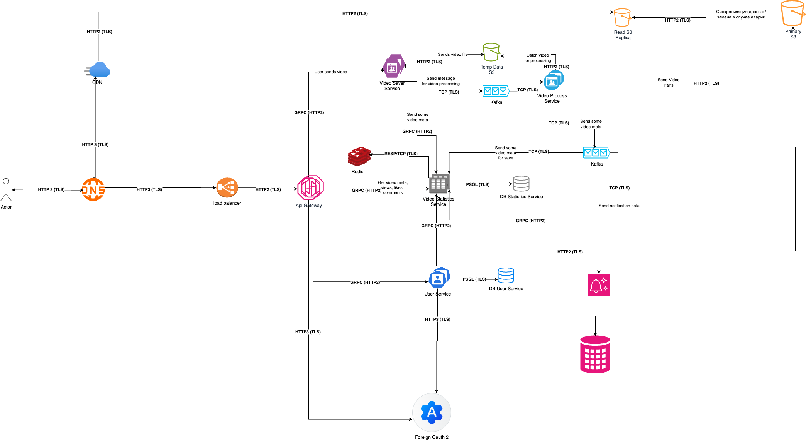

# Проектирование взаимодействия микросервисов с использованием современных сетевых технологий и систем сообщений
# Проектирование около Ютуба

## 0. О системе
Копия из HW2

## 1. Выбор сетевых протоколов и их интеграция
### 1.1. Архитектура / Схема
Архитектура - копия из HW2, только сократил дубли для наглядности

### 1.2. Архитектура / Текст
1. Запросы от клиента до API Getaway идут по HTTP3 + TLS + REST (с понижением до HTTP2)
   1. От Load Balancer до API Getaway идут HTTP2 запросы, так как он не создает много соединений как HTTP1 и лучше 
   компрессирует данные, а также HTTP3 был бы оверхедом, так как ел бы больше ресурсом, а его плюсы по сравнению с HTTP2 здесь не нужны.
   2. От клиента до Load Balancer идут HTTP3 запросы, так как у клиента может быть нестабильный интернет, а повышение
   нагрузки его CPU незначительно.
   3. Также можно было бы рассмотреть GraphQL, как альтернативу REST, но на него не было требований + у нас не так много
   сервисов и различных данных, чтобы для них тяжело было делать REST ручки.
   4. Все выше перечисленное аналогично для CDN.
2. Запросы от API Getaway до остальных внутренних сервисов и остальное синхронное общение между внутренними сервисами 
идут по gRPC.
   1. Он потребляет меньше ресурсов, чем REST.
   2. Строгая схема.
   3. Можно настроить удобную автогенерацию с CI/CD, который постит сгенерированные контракты в сервис хранения библиотек.
3. Между сервисом сохранения видео и сервисом обработки видео будет асинхронное общение, значит нужен брокер сообщений,
лучшим в нашем случае я посчитал Kafka, так как на этом куске нам важна надежность, и возможность восстановить таски.
Такое же общение будет в других сервисах где понадобится асинхронное взаимодействие, например, в сервисе нотификаций.
4. Общение с внешними сервисами будет зависеть от этих самых сервисов, как пример, я привел общение с внешним oauth по HTTP3.
5. Общение с Kafka, DB, Redis будет на их собственных протоколах.

## 2. Проектирование и реализация API
### 1. Спроектированный REST API Getaway см в [swagger.json](API/swagger.json) и [api.py](API/api.py)

### 2. Маршрутизация
Конфигурацию для деплоя и одного сервиса см в папке SD

1. Каждый Pod помечается значением из {labels}.
2. Service с {selector} собирает «живые» Pod’ы в EndpointSlice.
3. {readinessProbe} определяет, включать ли Pod в список «готовых».
4. CoreDNS публикует имя service.namespace -> список IP для headless-сервисов.
5. Клиенты резолвят имя через DNS.
6. Kubernetes сам обновляет список EndpointSlice при изменениях.

### 3. Аутентификации
Добавил 2 вида аутентификации:
1. Через собственный JWT токен:
   1. Пользователь отправляет креды.
   2. Получает access и refresh токены.
   3. На большинство запросов ходит по access токену.
   4. Когда он протухает рефрешим access токен через refresh токен.
2. Oauth
   1. Пользователь отправляет запрос на oauth.
   2. Его редиректит на внешний сервис.
   3. При успешной авторизации во внешнем сервисе пользователя редиректит к нам с его внешним токеном.
   4. Либо ходим в ручки по нему, либо добавляем ручку для логина по внешнему токену/данных из него.

## 3. Система сообщений
Используем Apache Kafka, так как у нас есть сообщения, которым требуется надежная доставка, 
а для тех случаев, где она не нужна, не хочется плодить зоопарк.

### Pub/Sub
После обработки видео используем kafka для отправки сообщений в разные сервисы.

Сервисы:
1. Сервис статистики видео (сохраняет информацию о видео).
2. Сервис нотификаций (отправляет автору уведомление о готовности видео к публикации и/или потребителям о выходе нового ролика)
3. (Можно подробить сервис нотификаций на email/push/sms).

Конфигурация:
1. Создаем 1 топик с 1 партицией
2. Прописываем разные group.id для разных сервисов (например, notifications/statistics...)

### Point-to-Point
Используем этот сценарий перед обработкой видео. 

Конфигурация:
1. Создаем 1 топик с количеством партиций {количеству инстансов обработчиков видео} X3.
2. Прописываем один group.id для всех инстансов сервиса обработки видео.
3. group.instance.id прокидываем в переменные окружение через kubernetes StatefulSet, что гарантирует сохранение имени при перезагрузке.

## 4. Сбои

## 4.1. Собой сервиса 

### Механизмы мониторинга
* Liveness/Readiness‑пробы (Kubernetes): нездоровые поды выводятся из балансировки, а readiness не пускает трафик до полного поднятия.
* API‑шлюз: health‑checks, таймауты, rate limiting.
* Идемпотентность ручек.
* Отключение второстепенных фич при деградации.

### При сбое
1. Пробы видят недоступность → под удаляется из балансировщика.
2. Критичные операции переигрываются через брокер/очередь или возвращают деградированный ответ/кэш.
3. Авто‑масштабирование/перезапуск восстанавливает под; breaker закрывается после «полосы здоровья».

## 4.2. Сбой брокера сообщений

### Механизмы мониторинга:
* Репликация и автоматическое лидер‑переключение.
* Настройка отдельной очереди для сообщений, которая обрабатывается с ошибками.
* At‑least‑once доставка + идемпотентные консьюмеры. 
* (Если сильно запариваться - запись события в локальную БД продюсера)

### При сбое
1. Падение одного брокера → лидерство переезжает на реплику; продюсеры/консюмеры переподключаются.
2. Продюсеры получают ошибки - они перенаправляются в отдельную очередь.

## 4.3 Отказ базы данных

### Механизмы мониторинга
* Primary/Replica с авто‑failover; клиенты используют read/write.
* Connection‑pool с хелзчеками, короткими таймаутами, быстрыми ретраи.
* Транзакционные гарантии внутри одного сервиса.
* Для межсервисных — SAGA/оркестрация с компенсациями.
* Резервные копии, проверка восстановления.

### При сбое
1. Падает primary -> реплика становится лидером.
2. Неполные кросс‑сервисные операции компенсируются (SAGA).
