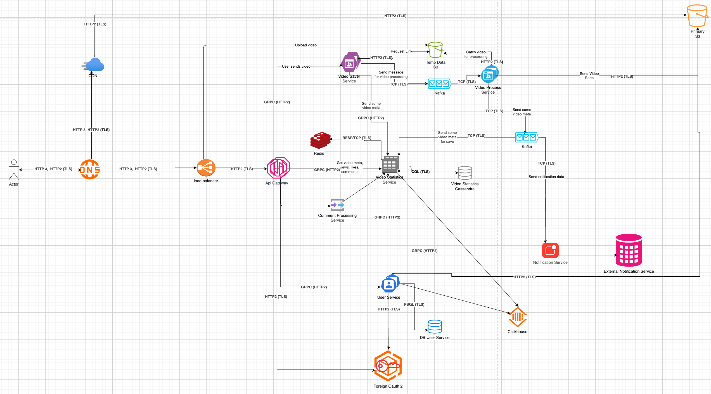
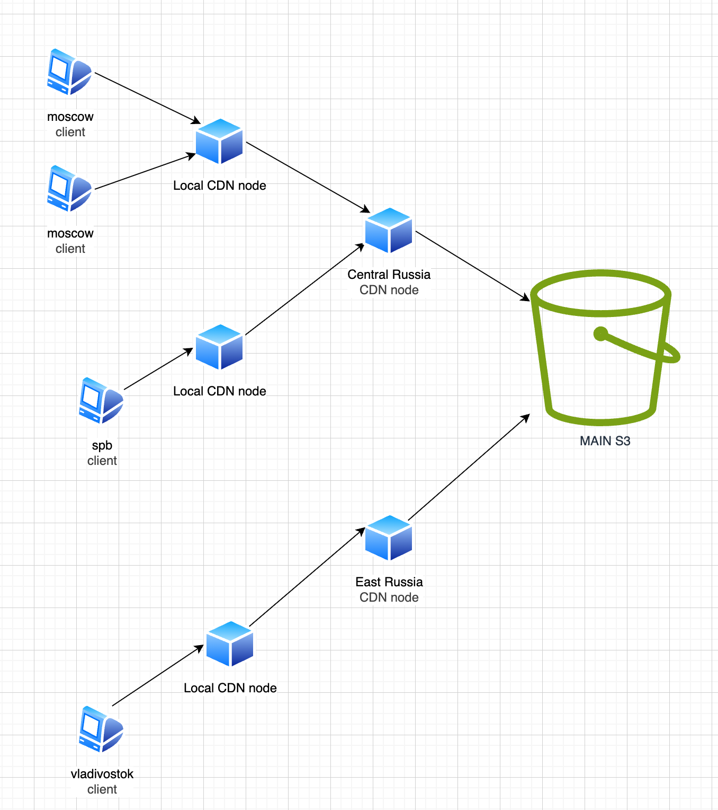

# Проектирование системы хранения данных и повышения производительности с использованием БД, кэша и CDN
# Проектирование около Ютуба

## 0. Архитектура
### 0.1. Схема
Решил отойти от нескольких кластеров. Используем 1 большой гео-распределенный кластер.
DNS будет направлять пользователя на ближайшие nginx.



### 0.2. НФТ (из замечаний к прошлому ДЗ)
1. До 300 млн пользователей
2. Усреднено сервис должен выдерживать загрузку 200 получасовых видео в день
3. 600 тыс просмотров в день (суммарно).
4. 2.4 млн запросов в день (не считая файлов видео, но включая получение их ссылок).
4. Бессрочный срок хранения данных о пользователе, о видео, файлов видео, актуальных превью и аватаров.
5. Система должна быть доступна 99.9% времени в году.
6. Обновления контента должны появляться у пользователя не позже чем через день.

## 1. Выбор и проектирование базы данных

### 1.1. Для хранения информации о видео используем CassandraDB
* Тут нам важна легкая масштабируемость.
* Не особо важно если мы потеряем какие-то данные по лайкам/комментариям.
* Для важных данных ждем пока они синхронизируются по {replication_factor} репликам.

Храним отдельно комменты для отображения списком (для комментов), поиск по Clustering key (для лайков и дизлайков)

И отдельно храним счетчики (можно передавать всегда вместе с инфой про видео).
shard - поле для уменьшения количества блокировок. при запросе количества лайков берем список comment_counters и суммируем все по video_id.
shard определяется по hash(video_id, user_id) % videos.shards

```sql
CREATE TABLE comments (
  video_id uuid,                  -- Partition key
  bucket int                      -- Partition key
  created_at timestamp,           -- Clustering key
  id uuid,                        -- Clustering key
  author_id uuid,
  body text,
  state tinyint,
  PRIMARY KEY ((video_id, bucket), created_at, id)
) WITH CLUSTERING ORDER BY (created_at DESC);

CREATE TABLE comment_counters (
  video_id uuid,
  shard int,
  total counter,
  PRIMARY KEY (video_id, shard)
);

-- Лайки и дизлайки будут работать аналогично
CREATE TABLE likes (...);
CREATE TABLE like_counters (...);
CREATE TABLE dislikes (...);
CREATE TABLE dislike_counters (...);

CREATE TABLE videos (
  id uuid,                        -- Partition key
  created_at timestamp,
  author_id uuid,
  name text,
  duration: int,
  link_preview text,
  links text[],
  shards int,
  PRIMARY KEY (id)
) WITH CLUSTERING ORDER BY (created_at DESC);
```

Cassandra хороша тем, что она почти сама занимается масштабированием.
Создаем 30 инстансов, проставляем replication_factor = 3.
При необходимости добавляем инстанс, Cassandra сама разргрузит остальные, главное не добавлять сразу много.


### 1.2. Для хранения информации о пользователях используем PostgreSQL
* Желательно не потерять пользовательские данные.
* Ждем пока данные распространятся по всем репликам.
* Есть констрейнты.

Данные по авторизации будут храниться в внешнем сервисе авторизации

```sql
CREATE TABLE users (
   id uuid PRIMARY KEY,
   first_name text,
   middle_name text,
   last_name text,
   phone text,
   avatar_link text,
);
CREATE INDEX users_phone ON users(phone);
```

Используем одну master DB, и создаем 2-3 slave реплики, при необходимости добавляем slave-ов.
Настраиваем замену мастера при отказе.
Тут будет очень мало операций записи.

### 1.3. Для аналитики используем ClickHouse

```sql
CREATE TABLE comments
(
    video_id UUID,
    id UUID,
    text String,
    created_at DateTime,
    author_id UUID,
    body String,
    state Int8,
    PRIMARY KEY (video_id, created_at, id)
) ENGINE = MergeTree()
ORDER BY (video_id, created_at DESC, id);

CREATE TABLE likes (...);
CREATE TABLE dislikes (...);
```

Создаем одного master DB и при необходимости создаем 1 slave.
Вряд ли больше понадобиться, так как с ней будут взаимодействовать только аналитики.


# 2. Проектирование кэша

Неконсистентные данные нам не страшны, но желательно их обновлять. В каждом пункте расписал, как часто.

## 2.1. Кэш на стороне клиента
1. Храним статические ассеты плеера: JS/CSS/шрифты; Статические страницы;
Храним кэш месяц, версионирование по хэшу (например, app.\<hash\>.js, font.\<hash\>.css).

2. Превью / аватары / данные пользователя - храним
Храним кэш день, можно не заморачиваться с неконсистентностью.


Храним все это у клиента, чтобы он не видел анимацию загрузки, при этом весит эта информация не много.

## 2.2 CDN

В CDN будем хранить фрагменты видео. Храним кэш несколько дней.

Низкая задержка и высокая доступность обеспечивается многоуровневой и широкой структурой нод CDN.

Cхема работы CDN:



При долгой загрузке добавляем новые ноды для разделения трафика.

## 2.3. Межсервисный кэш

Используем редис.

Данные видео:
* Ключ: "video:{video_id}".
* Сами данные хранить в json.
* Храним 5-30 мин, так как в этой информации будут счетчики комментариев, лайков, дизлайков.

Лента комментариев:
* Ключ: "comments:{video_id}:{sort_type}".
* Храним как список страниц.
* Сами данные хранить в json.
* Храним 5-30 мин.

Для ускоренного обновления реакций/комментариев на видео, можно выделить их в отдельные ключи и добавить счетчики. При достижение определенного порога сбрасываем кэш реакций/комментариев по этому видео, на race condition можно забить, точность нам не важна.


# 3. Работа с требованиями системы

Консистентность:
* В рамках Cassandra - несколько реплик одни и тех же данных на разных нодах.
* В кэш используем только для операций чтения.
* Пользователю не нужны самые свежие данные.
* При необходимости используем SAGA. (в общем случае не нужен, но вдруг понадобится в части ручек/задач обеспечить консистентность)

Производительность:
* Кэш на всех уровнях.
* Большое количество слоев CDN.
* Много инстансов приложений.
* Легко расширяемая БД.

Доступность:
* Много инстансов приложений.
* Легко расширяемая БД.

При пиках нагрузки:
1. Кэширование и CDN
  * Популярные видео фрагменты заранее кэшируются на серверах CDN, которые географически ближе к пользователям. Это снижает нагрузку на центральное хранилище и ускоряет доставку.
  * В памяти (Redis или Memcached) держатся самые востребованные метаданные (названия, превью, счетчики просмотров).
2. Автоматическое масштабирование
  * При росте числа запросов автоматически поднимаются новые инстансы для обработки трафика.
3. Балансировка
  * Балансировщики равномерно распределяют запросы между серверами.
  * Пользователь не должен ждать долгой обработки видео тк она выполняется фоном, через очередь в кафке. И все загруженные видео обязательно обработаются.
  * При большой нагрузке можно просто подождать. но если нужно быстрее - с кафкой можно добавить партиции и ввести дополнительные обработчики
4. Адаптивное качество видео (ABR)
  * При обработке видео создаем фрагменты в разном качестве.
  * При перегрузке пользователи могут получать видео в более низком качестве.
5. БД
  * При постоянных перегрузках на бд, добавляем новые ноды не в час пик.


# 4. Мониторинг и отладка

## Ключевые метрики
1. База данных
* Доступность/подключения: активные/ожидающие коннекты, ошибки соединений.
* Запросы: временя работы запросов, TPS/QPS.
* Блокировки и транзакции: время ожидания блокировок, дедлоки, откаты, возраст долгих транзакций.
* Репликация: lag реплик.
* Ошибки: доля ошибочных запросов, исключения по типам.

2. Кэш (Redis/Memcached)
* Хиты/миссы.
* Память: использовано/всего, ключи, истечения (expired).

3. CDN
* Кэширование: Процент попаданий, загруженность основного s3.
* Трафик: RPS, egress ГБ по регионам, размер объектов.
* Ошибки: 4xx/5xx на edge и на origin, таймауты.

## Инструменты для мониторинга и поиска узких мест

1. Базовые:
  * Метрики/дашборды: Prometheus + Grafana.
  * Логи: ELK.
  * Уведомления при пробитии порога.
2. Специализированные DB-инструменты
  * PostgreSQL: запрос на explain, pg_stat_statements, auto_explain, Grafana.
  * CassandraDB: cassandra-exporter, Grafana.
  * Redis: RedisInsight, Grafana.
3. CDN и frontend
  * Метрики внешних сервисов: Cloudflare Analytics, аналитика от сервиса авторизации.
  * Frontend: SpeedCurve.
4. Нагрузочное тестирование
  * Python Locust.

# Как быстро находить узкие места (практика)

1. Следим за latency, traffic, errors, saturation на каждом слое.
2. БД — топ запросов по времени выполнения и количеству вызовов
3. Кэш — команды с наибольшей латентностью.
4. Уведомления:
   * DB: большие задержки в исполнении, долгий лаг репликаций, долгое время лока.
   * Redis: Сильное уменьшение попаданий.
   * Сеть: много ошибок при межсервисном взаимодействии (отдельно для внешних)
5. Пытаемся воспроизвести на нагрузочном тестировании.
