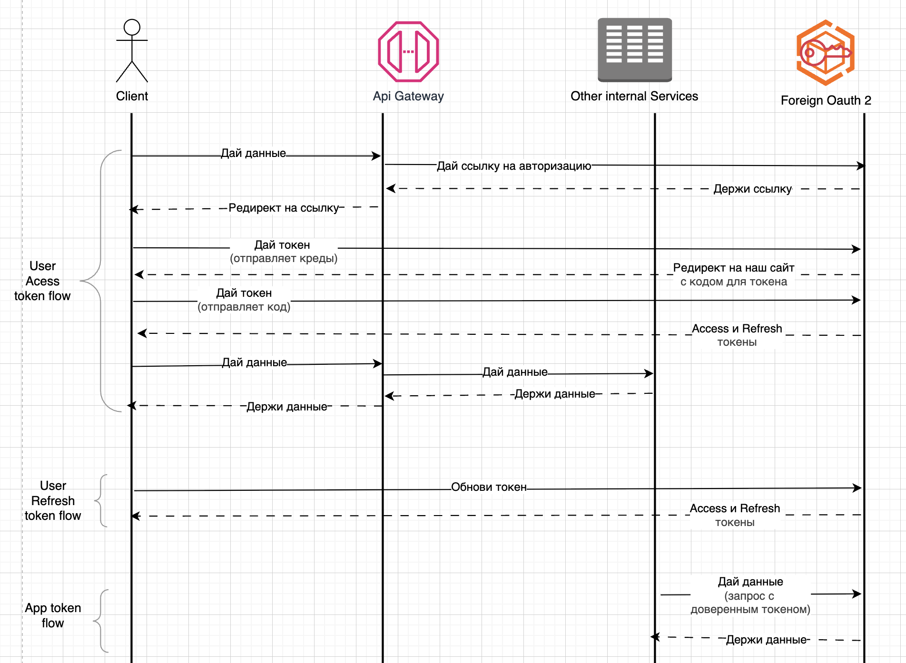

# Безопасность системы


## 0. Обновления в архитектуре
Сервис oauth был внешним, сейчас нам по сути нужно спроектировать его внутрянку, поэтому он будет внутренним и иметь свою бд Postgres.

## 1. Аутентификация и авторизация
У нас уже есть oauth2 сервис, будем считать, что он будет выдавать JWT access и refresh токены.

### Схема авторизации



### Схема ответа после авторизации
```json
{
  "access_token": {
    "value": "...",
    "expire_at": "2025-05-11 00:00:00"
  },
  "refresh_token": {
    "value": "...",
    "expire_at": "2025-06-11 00:00:00",
    "refresh_link": "https://not-scam.ru"
  },
}
```

### Схема расшифрованного payload access токена
```json
{
  "issuer": "https://not-scam.ru",
  "issued_at": "2025-05-10 23:00:00",
  "expire_at": "2025-05-11 00:00:00",
  "subject": "356ed5c6-827d-47ae-93bb-453d671f994d",  // id пользователя
  "token_id": "8c0304ca-9a6b-4a44-81ce-27c536e9b218",
  "role": "some_role",
  "permissions": [
    "read_some_data",
    "write_other_data"
  ]
}
```

## 2. Безопасность передачи данных

### Использование TLS
* HSTS - Принудительный переход с HTTP на HTTPS.
* Используем только TLS 1.3 (PFS встроен).
* Выбираем сильные шифры: AES-256-GCM, ChaCha20-Poly1305.
* Используем TLS Session Tickets для ускорения реконекта.


### Шифрование данных
* Хешируем пароли через алгоритм Argon2id
* Шифруем персональные данные (email, номер телефона и другие) через алгоритм AES-256-GCM. В PG есть возможность делать это нативно, можно вшить в шаблон проектирования репозиторий.
* Шифруем JWT токены через ассиметричный ECDH-ES.

## 3. Управление доступами

Структура Postgres БД oauth сервиса:

```sql
CREATE TABLE users (
  id UUID PRIMARY KEY,
  first_name varchar(20),   --- вроде не нужно шифровать full name, но можно сделать по аналогии с phone
  middle_name varchar(20),
  last_name varchar(20),
  phone BYTEA,              --- шифрованные данные
  email BYTEA,              --- шифрованные данные
  password TEXT,            --- хешированные Argon2id данные
);

CREATE TABLE roles (
  key varchar(20) PRIMARY KEY,
  description varchar(100),
  is_default boolean        --- если понадобятся кастомные роли
);

CREATE TABLE permissions (
  key varchar(20) PRIMARY KEY,
  description varchar(100)
);

CREATE TABLE permissions_to_roles (
  permission_key varchar(20),
  role_key varchar(20),
  FOREIGN KEY (permission_key) REFERENCES permissions(key),
  FOREIGN KEY (role_key) REFERENCES roles(key)
);

CREATE TABLE users_to_roles (
  user_id UUID,
  role_key varchar(20),
  FOREIGN KEY (user_id) REFERENCES users(id),
  FOREIGN KEY (role_key) REFERENCES roles(key)
);
```

* Персональные данные должны быть зашифрованны
* Список прав всегда строго определен, может быть изменен только разработчиками при обновлениях.
* Также со списком ролей на старте и permissions_to_roles, в нашей системе не придумал кейсов для кастомных ролей, кроме этапа тестирования.
* Нельзя выдавать пользователям отдельные права, либо добавить ее в роль, либо создавать кастомную роль.
* Список прав определяется только разработчиками, так как в коде будут захардкожены ключи для них, и при попытке получения доступа к ресурсу будет проверяться наличие этого ключа в jwt токене.


## 4. Хранение и управление секретами

Используем Vault (HashiCorp).

### Схема безопасного хранения
Статические секреты:
* /kv/{environment_name}/{service_name}
* Пример пути: /kv/prod/oauth
* Пример:
```json
{
  "APP_NAME": "Oauth",
  "LINK_TO_SOME_SERVICE": "",
  "SOME_RETRY_DELAY": ""
}
```

Динамические секреты для БД:
* /database/{environment_name}/roles/{service_name}
* Пример пути: /database/prod/roles/oauth
* Пример:
```json
{
  "DB_ADDRESS": "postgres://not_postgres:1337",
  "DB_DB_NAME": "not_postgres",
  "DB_USER": "not_postgres",
  "DB_PASSWORD": "not_postgres"
}
```

Динамические секреты для шифрования:
* /keys/{environment_name}/{service_name}
* Пример пути: /keys/prod/roles/oauth
* Пример:
```json
{
  "JWT_SIGNER": "aboba.data.data"
}
```

### Ротация динамических секретов
* Настраиваем временные учетки в Vault на часы/дни
* Приложение берет новые перед истечением, храним ttl в приложении.
* Админ раз в месяц меняет основную учетку.


## 5. Мониторинг и аудит безопасности

### Логи
Не логируем токены и персональные данные.
* если нужно понять, что за пользователь - логируем айди.
* токены можно логировать в хешированном виде (Argon2id).

Примеры логов:
* Успешный вход: Пользователь, IP-адрес, время, устройство.
* Неуспешный вход: Причина (неверный пароль, заблокированный аккаунт), количество попыток.
* Ошибки авторизации: Попытка доступа к ресурсу без прав, пользователь, запрошенный ресурс.
* Изменения конфигурации / динамическая ротация секретов.
* Атаки и инциденты: DDoS-атаки, brute-force, подозрительные запросы.

### Метрики
* Количество запросов к ресурсам, на которые у пользователя нет прав.
* Количество пользователей с слишком большим RPS.
* RPS с одного IP по авторизации.
